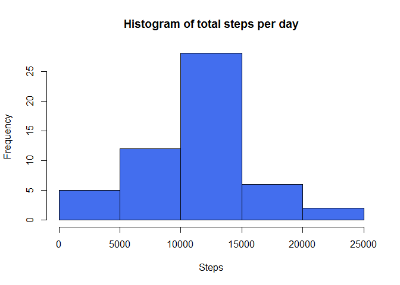
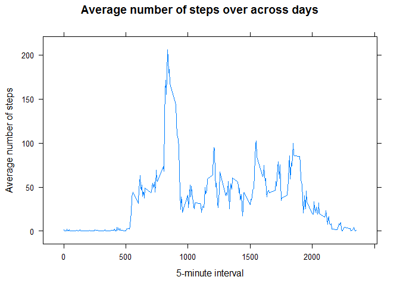
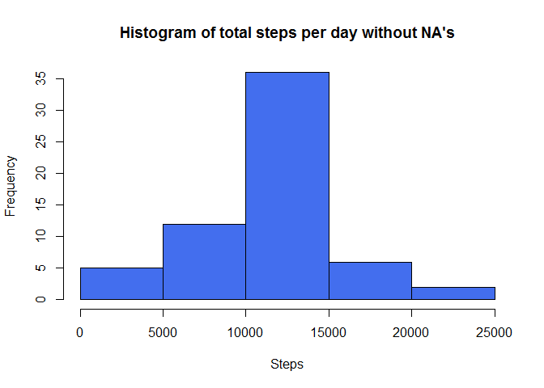
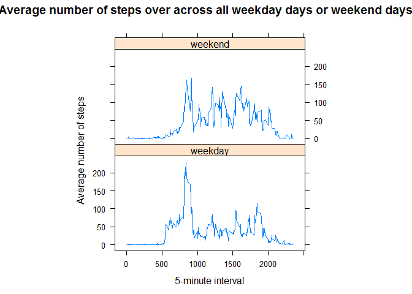

# Reproducible Research: Peer Assessment 1


## Loading and preprocessing the data
1. Load the data

```r
activity <- read.csv(unz("activity.zip", "activity.csv"))
summary (activity)
```

```
##      steps                date          interval     
##  Min.   :  0.00   2012-10-01:  288   Min.   :   0.0  
##  1st Qu.:  0.00   2012-10-02:  288   1st Qu.: 588.8  
##  Median :  0.00   2012-10-03:  288   Median :1177.5  
##  Mean   : 37.38   2012-10-04:  288   Mean   :1177.5  
##  3rd Qu.: 12.00   2012-10-05:  288   3rd Qu.:1766.2  
##  Max.   :806.00   2012-10-06:  288   Max.   :2355.0  
##  NA's   :2304     (Other)   :15840
```
2. Process/transform the data into a format suitable for the analysis

No process needed

```r
head (activity)
```

```
##   steps       date interval
## 1    NA 2012-10-01        0
## 2    NA 2012-10-01        5
## 3    NA 2012-10-01       10
## 4    NA 2012-10-01       15
## 5    NA 2012-10-01       20
## 6    NA 2012-10-01       25
```

## What is mean total number of steps taken per day?

1. Calculate the total number of steps taken per day

```r
stepsPerDay <- aggregate(steps ~ date,data = activity, sum, na.rm = TRUE)
```

2. Make a histogram of the total number of steps taken each day


```r
hist(stepsPerDay$steps, main = "Histogram of total steps per day", xlab = "Steps", col = "royalblue2")
```

 

3 .Calculate and report the mean and median of the total number of steps taken per day

```r
meanOfStepsPerDay <- mean(stepsPerDay$steps)
cat("Mean steps per day = ",meanOfStepsPerDay)
```

```
## Mean steps per day =  10766.19
```

```r
medianOfStepsPerDay <- median(stepsPerDay$steps)
cat("Median steps per day = ",medianOfStepsPerDay)
```

```
## Median steps per day =  10765
```


```r
summary(stepsPerDay)
```

```
##          date        steps      
##  2012-10-02: 1   Min.   :   41  
##  2012-10-03: 1   1st Qu.: 8841  
##  2012-10-04: 1   Median :10765  
##  2012-10-05: 1   Mean   :10766  
##  2012-10-06: 1   3rd Qu.:13294  
##  2012-10-07: 1   Max.   :21194  
##  (Other)   :47
```

The steps per day **mean** is 10766.19 steps.

The steps per day **median** is 10765.00 steps.

## What is the average daily activity pattern?

1. Make a time series plot (i.e. type = "l") of the 5-minute interval (x-axis) and the average number of steps taken, averaged across all days (y-axis)

```r
stepsPerInterval <- aggregate(steps ~ interval, data = activity, mean, na.rm = TRUE)

library(lattice)
xyplot(stepsPerInterval$steps ~ stepsPerInterval$interval, 
     type = 'l', 
     main = "Average number of steps over across days", 
     xlab = "5-minute interval", 
     ylab = "Average number of steps")
```

 

2. Which 5-minute interval, on average across all the days in the dataset, contains the maximum number of steps?

```r
maxNumOfStepsInterval <- stepsPerInterval$interval[which.max(stepsPerInterval$steps)]
print(maxNumOfStepsInterval)
```

```
## [1] 835
```

The interval 835 contains the maximun number of steps


## Imputing missing values

1. Calculate and report the total number of missing values in the dataset (i.e. the total number of rows with NAs)

```r
rowsWithNAs <- sum(!complete.cases(activity))
print(rowsWithNAs)
```

```
## [1] 2304
```

Total number of missing values in the dataset: 2304

2. Devise a strategy for filling in all of the missing values in the dataset. 

All NA's are replaced with the mean of 5-minute interval

3. Create a new dataset that is equal to the original dataset but with the missing data filled in.

```r
activityFilled <- merge(activity, stepsPerInterval, by="interval", suffixes=c("",".mean"))
nas <- is.na(activityFilled$steps)
activityFilled$steps[nas] <- activityFilled$steps.mean[nas]
activityFilled <- activityFilled[,c(2,3,1)]
activityFilled <- activityFilled[with(activityFilled, order(date)),]
```


4. Make a histogram of the total number of steps taken each day and Calculate and report the mean and median total number of steps taken per day. Do these values differ from the estimates from the first part of the assignment? What is the impact of imputing missing data on the estimates of the total daily number of steps?


```r
stepsPerDayFilled <- aggregate(steps ~ date,data = activityFilled, sum, na.rm = TRUE)

hist(stepsPerDayFilled$steps, main = "Histogram of total steps per day without NA's", xlab="Steps", col="royalblue2")
```

 

```r
meanOfStepsPerDayFilled <- mean(stepsPerDayFilled$steps)
cat("Mean steps per day = ",meanOfStepsPerDayFilled)
```

```
## Mean steps per day =  10766.19
```

```r
medianOfStepsPerDayFilled <- median(stepsPerDayFilled$steps)
cat("Median steps per day = ",medianOfStepsPerDayFilled)
```

```
## Median steps per day =  10766.19
```

```r
summary(stepsPerDayFilled)
```

```
##          date        steps      
##  2012-10-01: 1   Min.   :   41  
##  2012-10-02: 1   1st Qu.: 9819  
##  2012-10-03: 1   Median :10766  
##  2012-10-04: 1   Mean   :10766  
##  2012-10-05: 1   3rd Qu.:12811  
##  2012-10-06: 1   Max.   :21194  
##  (Other)   :55
```

The steps per day **mean** is 10766.19 steps.

The steps per day **median** is 10766.19 steps.

The **mean** value is the **same** as the previous value because of the strategy based on the mean for 5-minute intervals. 
The **median** is very slightly different.

## Are there differences in activity patterns between weekdays and weekends?


1. Create a new factor variable in the dataset with two levels - "weekday" and "weekend" indicating whether a given date is a weekday or weekend day.


```r
Sys.setlocale("LC_TIME", "English")
```

```
## [1] "English_United States.1252"
```

```r
daytype <- function(date) {
        ifelse(weekdays(as.Date(date)) %in% c("Saturday","Sunday"),"weekend", "weekday")
}
activityFilled$daytype <- as.factor(sapply(activityFilled$date,daytype))
head (activityFilled)
```

```
##         steps       date interval daytype
## 1   1.7169811 2012-10-01        0 weekday
## 63  0.3396226 2012-10-01        5 weekday
## 128 0.1320755 2012-10-01       10 weekday
## 205 0.1509434 2012-10-01       15 weekday
## 264 0.0754717 2012-10-01       20 weekday
## 327 2.0943396 2012-10-01       25 weekday
```


2. Make a panel plot containing a time series plot (i.e. type = "l") of the 5-minute interval (x-axis) and the average number of steps taken, averaged across all weekday days or weekend days (y-axis). 


```r
stepsPerIntervalPerType <- aggregate(steps~interval+daytype,activityFilled,mean)

library(lattice)
xyplot(steps ~ interval | factor(daytype),
       data = stepsPerIntervalPerType,
       aspect = 1/2,
       type = "l",
       main = "Average number of steps over across all weekday days or weekend days",
       ylab = "Average number of steps",
       xlab = "5-minute interval")
```

 

